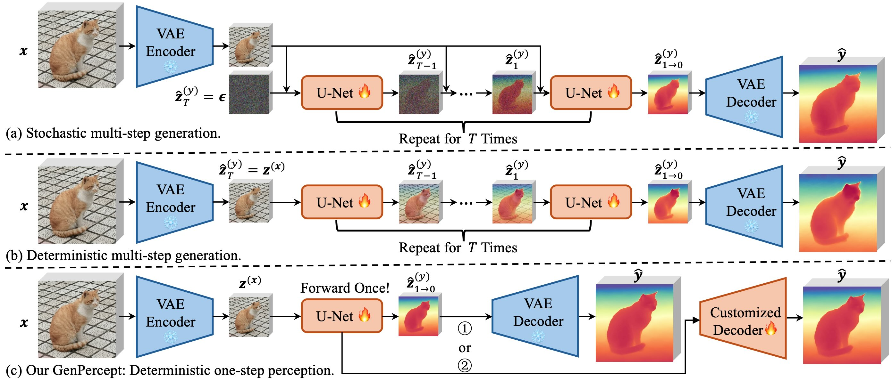
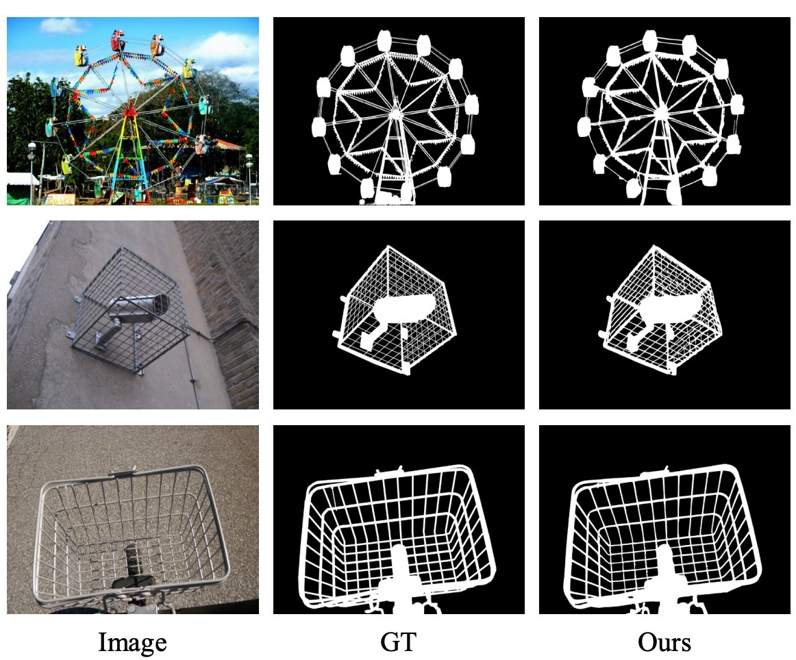

<div align="center">

<h1> GenPercept: Diffusion Models Trained with Large Data Are Transferable Visual Models </h1>

[Guangkai Xu](https://github.com/guangkaixu/), &nbsp; 
[Yongtao Ge](https://yongtaoge.github.io/), &nbsp; 
[Mingyu Liu](https://mingyulau.github.io/), &nbsp;
[Chengxiang Fan](https://leaf1170124460.github.io/), &nbsp;
[Kangyang Xie](https://github.com/felix-ky), &nbsp;
[Zhiyue Zhao](https://github.com/ZhiyueZhau), &nbsp;
[Hao Chen](https://stan-haochen.github.io/), &nbsp;
[Chunhua Shen](https://cshen.github.io/), &nbsp;

Zhejiang University

### [HuggingFace (Space)](https://huggingface.co/spaces/guangkaixu/GenPercept) | [HuggingFace (Model)](https://huggingface.co/guangkaixu/GenPercept) | [arXiv](https://arxiv.org/abs/2403.06090)

#### 🔥 Fine-tune diffusion models for perception tasks, and inference with only one step! ✈️

</div>

<div align="center">

</div>


##  📢 News
- 2024.4.30: Release checkpoint weights of surface normal and dichotomous image segmentation.
- 2024.4.7:  Add [HuggingFace](https://huggingface.co/spaces/guangkaixu/GenPercept) App demo. 
- 2024.4.6:  Release inference code and depth checkpoint weight of GenPercept in the [GitHub](https://github.com/aim-uofa/GenPercept) repo.
- 2024.3.15: Release [arXiv v2 paper](https://arxiv.org/abs/2403.06090v2), with supplementary material.
- 2024.3.10: Release [arXiv v1 paper](https://arxiv.org/abs/2403.06090v1).


##  🖥️ Dependencies

```bash
conda create -n genpercept python=3.10
conda activate genpercept
pip install -r requirements.txt
pip install -e .
```

## 🚀 Inference

Download the pre-trained models ```genpercept_ckpt_v1.zip``` from [BaiduNetDisk](https://pan.baidu.com/s/1n6FlqrOTZqHX-F6OhcvNyA?pwd=g2cm) (Extract code: g2cm), [HuggingFace](https://huggingface.co/guangkaixu/GenPercept), or [Rec Cloud Disk (To be uploaded)](). Please unzip the package and put the checkpoints under ```./weights/v1/```.

Then, place images in the ```./input/$TASK_TYPE``` dictionary, and run the following script. The output depth will be saved in ```./output/$TASK_TYPE```. The ```$TASK_TYPE``` can be chosen from ```depth```, ```normal```, and ```dis```.
```bash
sh scripts/inference_depth.sh
```

For surface normal estimation and dichotomous image segmentation
, run the following script:
```bash
bash scripts/inference_normal.sh
bash scripts/inference_dis.sh
```

Thanks to our one-step perception paradigm, the inference process runs much faster. (Around 0.4s for each image on an A800 GPU card.)

## 📖 Recommanded Works

- Marigold: Repurposing Diffusion-Based Image Generators for Monocular Depth Estimation. [arXiv](https://github.com/prs-eth/marigold), [GitHub](https://github.com/prs-eth/marigold).
- GeoWizard: Unleashing the Diffusion Priors for 3D Geometry Estimation from a Single Image. [arXiv](https://arxiv.org/abs/2403.12013), [GitHub](https://github.com/fuxiao0719/GeoWizard).
- FrozenRecon: Pose-free 3D Scene Reconstruction with Frozen Depth Models. [arXiv](https://arxiv.org/abs/2308.05733), [GitHub](https://github.com/aim-uofa/FrozenRecon).

## 🏅 Results in Paper

### Depth and Surface Normal

<div align="center">

</div>

### Dichotomous Image Segmentation

<div align="center">

</div>

### Image Matting

<div align="center">

</div>

### Human Pose Estimation

<div align="center">

</div>

## 🎫 License

For non-commercial use, this code is released under the [LICENSE](LICENSE).
For commercial use, please contact Chunhua Shen.

## 🎓 Citation
```
@article{xu2024diffusion,
  title={Diffusion Models Trained with Large Data Are Transferable Visual Models},
  author={Xu, Guangkai and Ge, Yongtao and Liu, Mingyu and Fan, Chengxiang and Xie, Kangyang and Zhao, Zhiyue and Chen, Hao and Shen, Chunhua},
  journal={arXiv preprint arXiv:2403.06090},
  year={2024}
}
```
