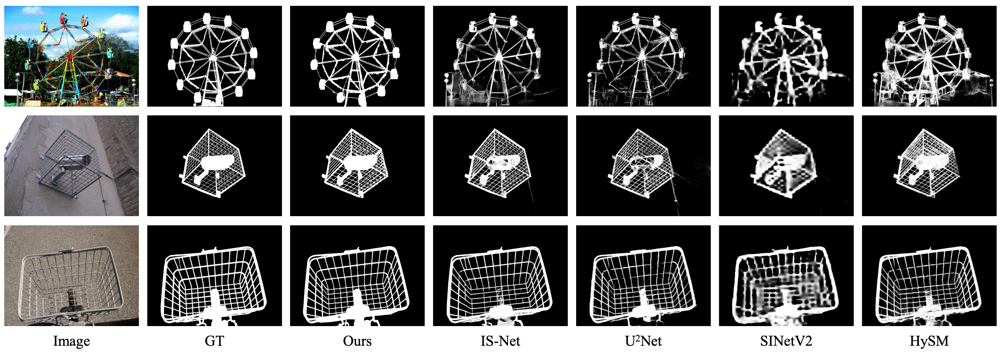
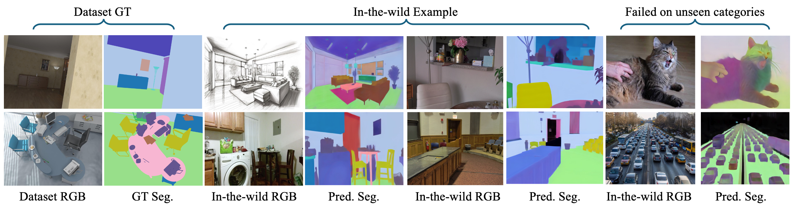

<div align="center">

<h1> What Matters When Repurposing Diffusion Models for General Dense Perception Tasks?<br>
(GenPercept: Diffusion Models Trained with Large Data Are Transferable Visual Models)</h1>

[Guangkai Xu](https://github.com/guangkaixu/), &nbsp; 
[Yongtao Ge](https://yongtaoge.github.io/), &nbsp; 
[Mingyu Liu](https://mingyulau.github.io/), &nbsp;
[Chengxiang Fan](https://leaf1170124460.github.io/), &nbsp;<br>
[Kangyang Xie](https://github.com/felix-ky), &nbsp;
[Zhiyue Zhao](https://github.com/ZhiyueZhau), &nbsp;
[Hao Chen](https://stan-haochen.github.io/), &nbsp;
[Chunhua Shen](https://cshen.github.io/), &nbsp;

Zhejiang University

### [HuggingFace (Space)](https://huggingface.co/spaces/guangkaixu/GenPercept) | [HuggingFace (Model)](https://huggingface.co/guangkaixu/genpercept-models) | [arXiv](https://arxiv.org/abs/2403.06090)

#### 🔥 Fine-tune diffusion models for perception tasks, and inference with only one step! ✈️

</div>

<div align="center">

</div>


##  📢 News
- 2024.10.24 Release latest training and inference code, which is armed with the [accelerate](https://github.com/huggingface/accelerate) library and based on [Marigold](https://github.com/prs-eth/marigold).
- 2024.10.24 Release [arXiv v3 paper](https://arxiv.org/abs/2403.06090v3). We reorganize the structure of the paper and offer more detailed analysis.
- 2024.4.30: Release checkpoint weights of surface normal and dichotomous image segmentation.
- 2024.4.7:  Add [HuggingFace](https://huggingface.co/spaces/guangkaixu/GenPercept) App demo. 
- 2024.4.6:  Release inference code and depth checkpoint weight of GenPercept in the [GitHub](https://github.com/aim-uofa/GenPercept) repo.
- 2024.3.15: Release [arXiv v2 paper](https://arxiv.org/abs/2403.06090v2), with supplementary material.
- 2024.3.10: Release [arXiv v1 paper](https://arxiv.org/abs/2403.06090v1).


##  🖥️ Dependencies

```bash
conda create -n genpercept python=3.10
conda activate genpercept
pip install -r requirements.txt
pip install -e .
```

## 🚀 Inference
### Using Command-line Scripts
Download the [stable-diffusion-2-1](https://huggingface.co/stabilityai/stable-diffusion-2-1) and [our trained models](https://huggingface.co/guangkaixu/genpercept-models) (uploading...) from HuggingFace and put the checkpoints under ```./pretrained_weights/``` and ```./weights/```, respectively. You can download them with the script ```script/download_sd21.sh``` and ```script/download_weights.sh```, or download the weights of [depth](https://huggingface.co/guangkaixu/genpercept-depth), [normal](https://huggingface.co/guangkaixu/genpercept-normal), [Dichotomous Image Segmentation](https://huggingface.co/guangkaixu/genpercept-dis), [matting](https://huggingface.co/guangkaixu/genpercept-matting), [segmentation](https://huggingface.co/guangkaixu/genpercept-seg), [disparity](https://huggingface.co/guangkaixu/genpercept-disparity), [disparity_dpt_head](https://huggingface.co/guangkaixu/genpercept-disparity-dpt-head) seperately.

Then, place images in the ```./input/``` dictionary. We offer demo images in [Huggingface](guangkaixu/genpercept-input-demo), and you can also download with the script ```script/download_sample_data.sh```. Then, run inference with scripts as below.

```bash
# depth
bash script/infer/main_paper/inference_genpercept_depth.sh
# normal
bash script/infer/main_paper/inference_genpercept_normal.sh
# dis
bash script/infer/main_paper/inference_genpercept_dis.sh
# matting
bash script/infer/main_paper/inference_genpercept_matting.sh
# seg
bash script/infer/main_paper/inference_genpercept_seg.sh
# disparity
bash script/infer/main_paper/inference_genpercept_disparity.sh
# disparity_dpt_head
bash script/infer/main_paper/inference_genpercept_disparity_dpt_head.sh
```

***Thanks to our one-step perception paradigm, the inference process runs much faster. (Around 0.4s for each image on an A800 GPU card.)***


### Using torch.hub

TODO

<!-- GenPercept models can be easily used with torch.hub for quick integration into your Python projects. Here's how to use the models for normal estimation, depth estimation, and segmentation:
#### Normal Estimation
```python
import torch
import cv2
import numpy as np

# Load the normal predictor model from torch hub
normal_predictor = torch.hub.load("hugoycj/GenPercept-hub", "GenPercept_Normal", trust_repo=True)

# Load the input image using OpenCV
image = cv2.imread("path/to/your/image.jpg", cv2.IMREAD_COLOR)

# Use the model to infer the normal map from the input image
with torch.inference_mode():
    normal = normal_predictor.infer_cv2(image)

# Save the output normal map to a file
cv2.imwrite("output_normal_map.png", normal)
```

#### Depth Estimation
```python
import torch
import cv2

# Load the depth predictor model from torch hub
depth_predictor = torch.hub.load("hugoycj/GenPercept-hub", "GenPercept_Depth", trust_repo=True)

# Load the input image using OpenCV
image = cv2.imread("path/to/your/image.jpg", cv2.IMREAD_COLOR)

# Use the model to infer the depth map from the input image
with torch.inference_mode():
    depth = depth_predictor.infer_cv2(image)

# Save the output depth map to a file
cv2.imwrite("output_depth_map.png", depth)
```

#### Segmentation
```python
import torch
import cv2

# Load the segmentation predictor model from torch hub
seg_predictor = torch.hub.load("hugoycj/GenPercept-hub", "GenPercept_Segmentation", trust_repo=True)

# Load the input image using OpenCV
image = cv2.imread("path/to/your/image.jpg", cv2.IMREAD_COLOR)

# Use the model to infer the segmentation map from the input image
with torch.inference_mode():
    segmentation = seg_predictor.infer_cv2(image)

# Save the output segmentation map to a file
cv2.imwrite("output_segmentation_map.png", segmentation)
``` -->

## 🔧 Train

TODO

## 📖 Recommanded Works

- Marigold: Repurposing Diffusion-Based Image Generators for Monocular Depth Estimation. [arXiv](https://github.com/prs-eth/marigold), [GitHub](https://github.com/prs-eth/marigold).
- GeoWizard: Unleashing the Diffusion Priors for 3D Geometry Estimation from a Single Image. [arXiv](https://arxiv.org/abs/2403.12013), [GitHub](https://github.com/fuxiao0719/GeoWizard).
- FrozenRecon: Pose-free 3D Scene Reconstruction with Frozen Depth Models. [arXiv](https://arxiv.org/abs/2308.05733), [GitHub](https://github.com/aim-uofa/FrozenRecon).


## 🏅 Results in Paper

### Depth and Surface Normal

<div align="center">

</div>

### Dichotomous Image Segmentation

<div align="center">

</div>

### Image Matting

<div align="center">

</div>

### Image Segmentation

<div align="center">

</div>


## 🎫 License

For non-commercial academic use, this project is licensed under [the 2-clause BSD License](https://opensource.org/license/bsd-2-clause). 
For commercial use, please contact [Chunhua Shen](mailto:chhshen@gmail.com).


## 🎓 Citation
```
@article{xu2024diffusion,
  title={What Matters When Repurposing Diffusion Models for General Dense Perception Tasks?},
  author={Xu, Guangkai and Ge, Yongtao and Liu, Mingyu and Fan, Chengxiang and Xie, Kangyang and Zhao, Zhiyue and Chen, Hao and Shen, Chunhua},
  journal={arXiv preprint arXiv:2403.06090},
  year={2024}
}
```
